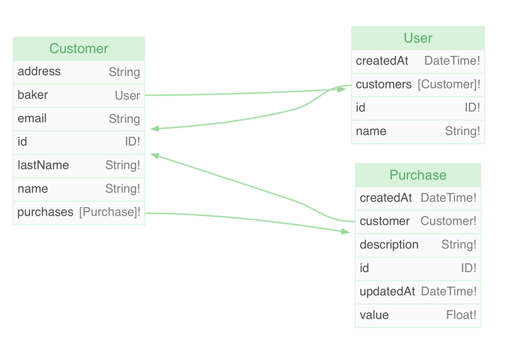
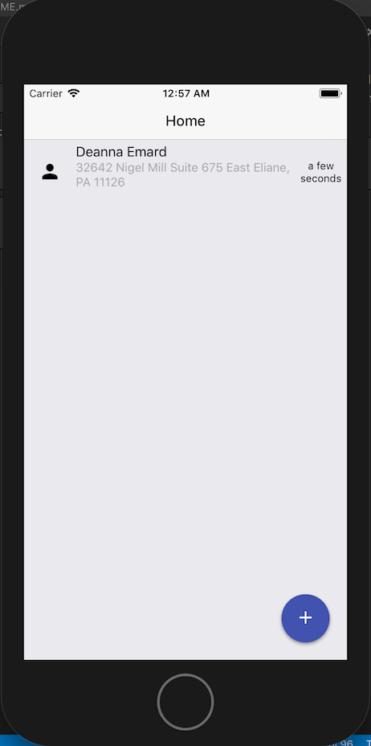
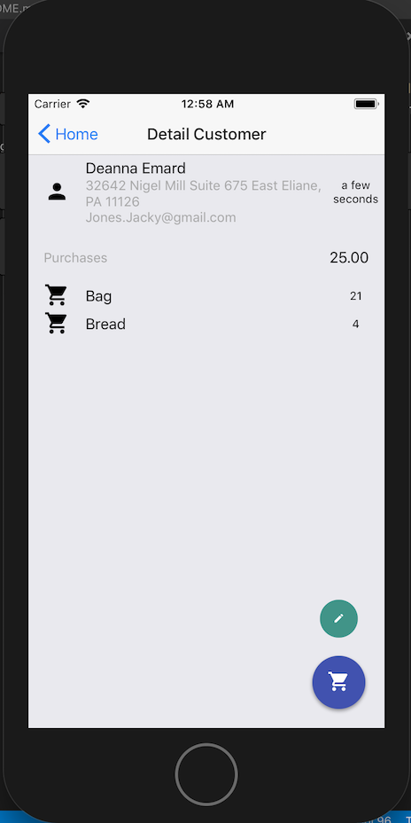
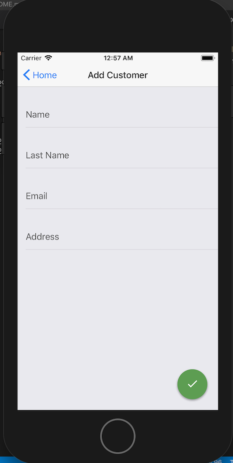
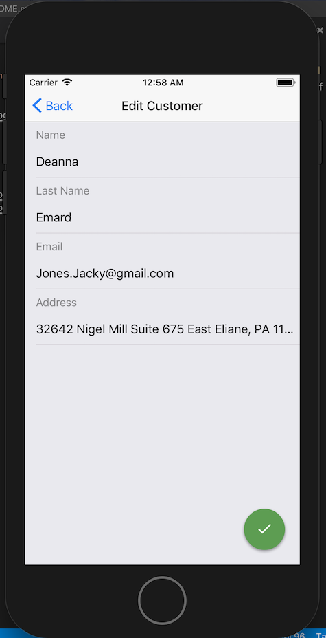
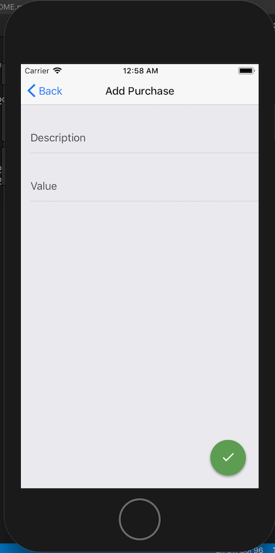

# BakeryApp

A quickly and beautiful bakery CRM app

See the development progress in this [board](https://trello.com/b/OZDxkW6C/bakeryapp)

## Getting Started

These instructions will get you a copy of the project up and running on your local machine for development and testing purposes.

### Installing

**Note: run in Release mode on iOS to hide a [known issue](#known-issues)**

* `yarn` - install dependencies
* `react-native run-ios --configuration Release` - run on iOS
* `react-native run-android` - run on Android

### Prerequisites

* `yarn` - brew install yarn
* `node` - brew install node
* `react-native-cli` - npm install -g react-native-cli
* `watchman`- brew install watchman
* `Xcode` - The easiest way to install Xcode is via the Mac App Store

For more information see the [link](https://facebook.github.io/react-native/docs/getting-started.html)

## Running the tests

Storybook and storyshots for BDD tests. Use storybook to see all of components and states

* `yarn test` - run storyshots
* `yarn storybook` - run storybook server
* Run `react-native run-ios` or `react-native run-android`

## Server

The server is a Open-source framework to develop and deploy production-ready serverless GraphQL backends.

### Model

## Known issues

* `RedBox - JSON value '<null>'` - there is an issue with `react-apollo` if you run in Debug mode on iOS. See more [here](https://github.com/apollographql/react-apollo/issues/1441)

## Screenshots

